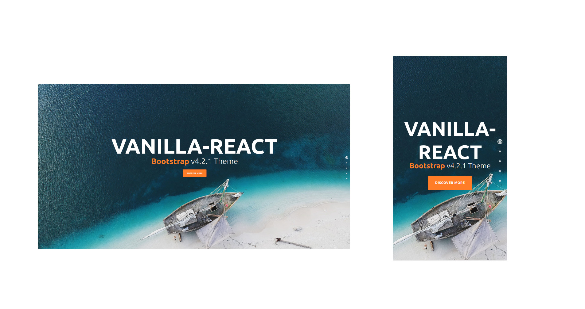

# Vanilla v.1 React -Template

- **Responsive Template made with React only**

---

## Quick Links

[Demo](#demo)


- [Picture](#picture-demo)

[Tech Stack](#tech-stack)

[About](#Implementation Highlights)

- [Current components on this template](#Current-components-on-this-template)

[Author](#author)

[License](#license)

---

### Picture Demo



---

## Tech Stack

- [React](https://github.com/facebook/react) 
  - Create-react-app with highly complex frontend structure
---

## Implementation Highlights

Responsive Template made with advanced react Js.

### Full Responsive Portfolio React Template

Full responsive for all mobile phones and tablets

### Current components on this template

- Navigation section.
- Home section.
- Services section.
- Portfolio with pictures gallery section.
- Our Story section.
- Contact Us with google Map section.
- Footer section.

---

## Author

- Rodolphe Augusto

---

## License

- MIT.

---
## Inspiration

-TemplateMo.com

## Start project
- Clone this repo https://github.com/rodolphe37/vanilla-react-template.git
- Do in the console :
-    ```cd vanilla-react-template```
-    ``` npm i``` or ```npm install ```
to install the dependencies and 
-    ```npm start```
to start project for personalisation.

enjoy!!!